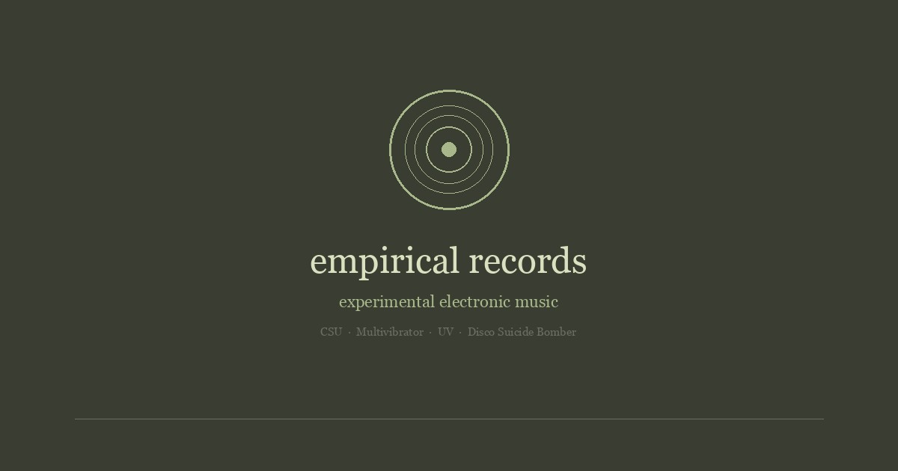

# empirical records

<div align="center">


</div>

<div align="center">
  
</div>

Independent archive of experimental electronic music from the 1990s and early 2000s.

**Live**: [www.empiricalrecords.com](https://www.empiricalrecords.com)

All releases are under [Creative Commons BY-SA 1.0](https://creativecommons.org/licenses/by-sa/1.0/).

## Artists

| Artist | Releases | Genre |
|--------|----------|-------|
| **CSU** | Data, Live 95, Boab, Nazca Plain | Heavy industrial |
| **Multivibrator** | Music For Stealth Bomber Pilots, Schmitt Trigger | Minimal experimental electronic |
| **UV** | (symbol), UFO | Guitar compositions, organic |
| **Disco Suicide Bomber** | Bombing For Love | Disco covers, experimental trance |

## Features

- **Generative art** - Canvas-based animated visuals per artist on the homepage and artist pages (`js/cards.js`)
- **Audio player** - Custom HTML5 audio player with keyboard navigation, auto-advances through all tracks (`js/player.js`)
- **Audio-reactive visuals** - Web Audio API frequency analysis feeds into canvas animations, each artist's visuals respond to bass, mid, and treble
- **Gallery** - Lightbox viewer for archival photos and artwork
- **SEO** - Per-page Open Graph images (1200x630), Twitter cards, SVG favicon, XML sitemap

## Deployment

```bash
python3 upload.py
```

Uploads all site files via FTPS to JustHost. Requires `.env` with FTP credentials (see `.env.example`). Includes post-deploy verification of all pages.

## Structure

```
index.html              Homepage with generative art cards
artist-*.html           Artist pages with player, hero animation, gallery
css/style.css           All styles
js/cards.js             Generative canvas animations (audio-reactive)
js/player.js            Audio player + lightbox
images/og/              Open Graph share images (1200x630)
upload.py               FTP deployment script
.htaccess               URL rewriting, security headers, GZIP, caching
CSU/                    CSU audio files + live photos
Multivibrator/          Multivibrator audio files
UV/                     UV audio files + artwork gallery
DiscoSuicideBomber/     DSB audio files
```
